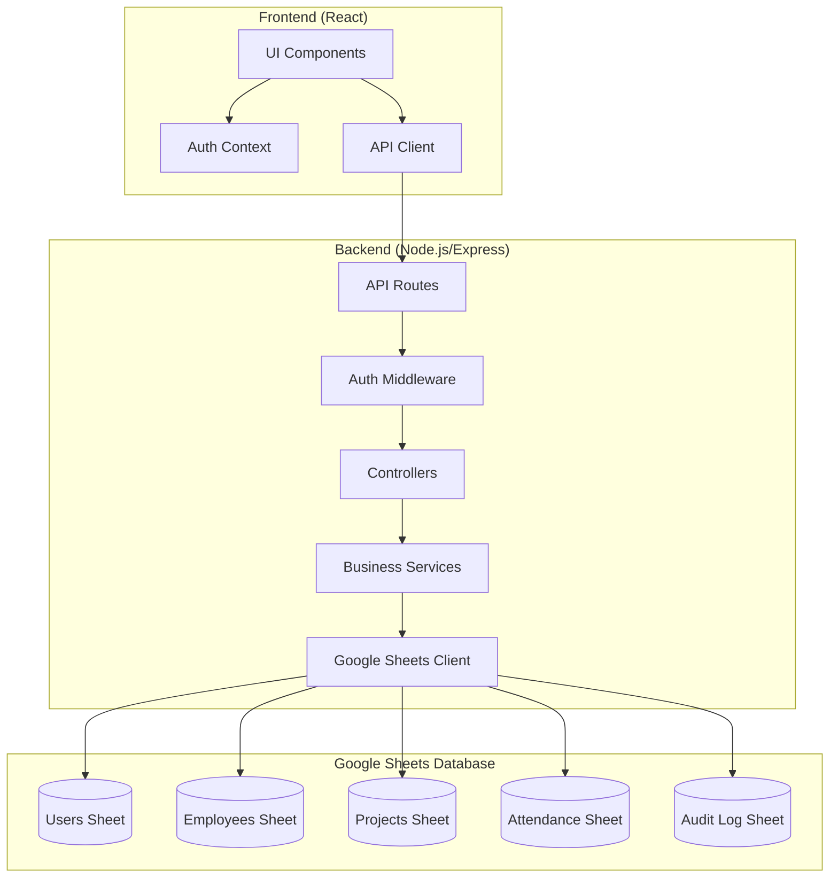
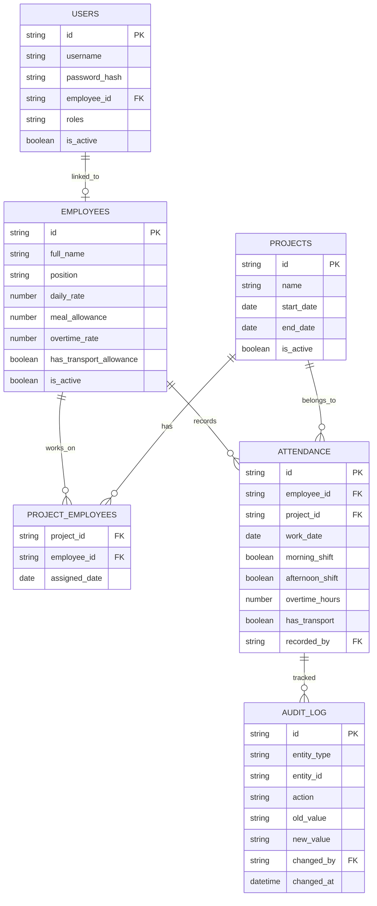

# Design Document: Hệ thống Quản lý Chấm công VectorCIC

## Overview

Hệ thống Quản lý Chấm công VectorCIC là ứng dụng web cho phép quản lý chấm công và tính lương cho công nhân xây dựng. Hệ thống hỗ trợ chấm công theo ca (sáng/chiều/tối), tính toán tự động các khoản lương bao gồm công nhật, phụ cấp cơm nước, tăng ca và xăng xe.

### Mục tiêu thiết kế
- Giao diện nhập liệu dạng bảng giống Excel để dễ sử dụng
- Tính toán lương tự động và chính xác
- Phân quyền linh hoạt với 4 vai trò
- Xuất báo cáo Excel theo định dạng chuẩn công ty

### Công nghệ sử dụng
- Frontend: React + TypeScript + TailwindCSS
- Backend: Node.js + Express + TypeScript
- Database: Google Sheets (via Google Sheets API)
- Export: ExcelJS cho xuất file Excel

### Lý do chọn Google Sheets làm Database
- Dễ dàng xem và chỉnh sửa dữ liệu trực tiếp trên Google Sheets
- Không cần setup database server
- Tích hợp sẵn với Google Workspace
- Phù hợp với quy mô nhỏ-vừa (< 500 nhân viên)
- Backup tự động bởi Google
- Có thể chia sẻ và phân quyền trực tiếp trên Google Sheets

## Architecture



### Kiến trúc tổng quan
- **3-tier architecture**: Presentation (React) → Business Logic (Express) → Data (Google Sheets)
- **RESTful API**: Giao tiếp giữa frontend và backend qua REST endpoints
- **JWT Authentication**: Xác thực người dùng bằng JSON Web Token
- **Role-based Access Control (RBAC)**: Phân quyền dựa trên vai trò
- **Google Sheets API**: Sử dụng googleapis package để đọc/ghi dữ liệu

## Components and Interfaces

### Frontend Components

```typescript
// Cấu trúc thư mục frontend
src/
├── components/
│   ├── Layout/
│   │   ├── Header.tsx
│   │   ├── Sidebar.tsx
│   │   └── Layout.tsx
│   ├── AttendanceTable/
│   │   ├── AttendanceGrid.tsx      // Bảng chấm công dạng grid
│   │   ├── AttendanceCell.tsx      // Ô nhập liệu
│   │   ├── AttendanceSummary.tsx   // Tổng hợp công/lương
│   │   └── ShiftRow.tsx            // Hàng ca sáng/chiều/tối
│   ├── Employee/
│   │   ├── EmployeeList.tsx
│   │   ├── EmployeeForm.tsx
│   │   └── EmployeeCard.tsx
│   ├── Project/
│   │   ├── ProjectList.tsx
│   │   └── ProjectForm.tsx
│   └── Report/
│       ├── SalaryReport.tsx
│       └── ExportButton.tsx
├── contexts/
│   └── AuthContext.tsx
├── hooks/
│   ├── useAttendance.ts
│   ├── useEmployees.ts
│   └── useProjects.ts
├── pages/
│   ├── Login.tsx
│   ├── Dashboard.tsx
│   ├── Attendance.tsx
│   ├── Employees.tsx
│   ├── Projects.tsx
│   ├── Reports.tsx
│   └── MyAttendance.tsx           // Trang cho Công nhân xem công cá nhân
└── utils/
    ├── api.ts
    ├── salaryCalculator.ts
    └── dateUtils.ts
```

### Backend API Endpoints

```typescript
// Authentication
POST   /api/auth/login              // Đăng nhập
POST   /api/auth/logout             // Đăng xuất
GET    /api/auth/me                 // Lấy thông tin user hiện tại

// Employees
GET    /api/employees               // Danh sách nhân viên
POST   /api/employees               // Thêm nhân viên
PUT    /api/employees/:id           // Cập nhật nhân viên
DELETE /api/employees/:id           // Xóa (soft delete) nhân viên

// Projects
GET    /api/projects                // Danh sách công trình
POST   /api/projects                // Thêm công trình
PUT    /api/projects/:id            // Cập nhật công trình
POST   /api/projects/:id/assign     // Phân công nhân viên

// Attendance
GET    /api/attendance              // Lấy bảng chấm công (theo tháng, công trình)
POST   /api/attendance              // Thêm/cập nhật chấm công
GET    /api/attendance/my           // Lấy chấm công cá nhân (cho Công nhân)

// Reports
GET    /api/reports/salary          // Báo cáo lương theo tháng
GET    /api/reports/export          // Xuất file Excel

// Audit
GET    /api/audit/:entityType/:id   // Lịch sử thay đổi

// Users (Admin only)
GET    /api/users                   // Danh sách users
POST   /api/users                   // Tạo user
PUT    /api/users/:id               // Cập nhật user/roles
```

### Service Interfaces

```typescript
// IAttendanceService
interface IAttendanceService {
  getAttendanceByMonth(projectId: string, month: number, year: number): Promise<AttendanceRecord[]>;
  saveAttendance(record: AttendanceInput): Promise<AttendanceRecord>;
  getMyAttendance(employeeId: string, month: number, year: number): Promise<AttendanceRecord[]>;
}

// ISalaryCalculator
interface ISalaryCalculator {
  calculateDailyWage(attendance: AttendanceRecord, employee: Employee): SalaryBreakdown;
  calculateMonthlySalary(records: AttendanceRecord[], employee: Employee): MonthlySalary;
}

// IExportService
interface IExportService {
  exportToExcel(projectId: string, month: number, year: number): Promise<Buffer>;
}
```

## Data Models

### Google Sheets Structure

Sử dụng một Google Spreadsheet với nhiều sheets (tabs):

```
📊 VectorCIC_Attendance_DB (Spreadsheet)
├── 📋 Users (Sheet)
├── 📋 Employees (Sheet)
├── 📋 Projects (Sheet)
├── 📋 ProjectEmployees (Sheet)
├── 📋 Attendance (Sheet)
└── 📋 AuditLog (Sheet)
```

### Sheet Schemas

#### Users Sheet
| Column | Type | Description |
|--------|------|-------------|
| id | string | UUID |
| username | string | Tên đăng nhập |
| password_hash | string | Mật khẩu đã hash |
| employee_id | string | Liên kết với Employee |
| roles | string | Comma-separated roles (admin,timekeeper) |
| is_active | boolean | TRUE/FALSE |
| created_at | datetime | Ngày tạo |
| updated_at | datetime | Ngày cập nhật |

#### Employees Sheet
| Column | Type | Description |
|--------|------|-------------|
| id | string | UUID |
| full_name | string | Họ và tên |
| position | string | Chức vụ |
| daily_rate | number | Đơn giá công nhật |
| meal_allowance | number | Phụ cấp cơm (mặc định 50000) |
| overtime_rate | number | Đơn giá tăng ca (auto-calculated) |
| has_transport_allowance | boolean | Có phụ cấp xăng xe |
| is_active | boolean | TRUE/FALSE |
| created_at | datetime | Ngày tạo |
| updated_at | datetime | Ngày cập nhật |

#### Projects Sheet
| Column | Type | Description |
|--------|------|-------------|
| id | string | UUID |
| name | string | Tên công trình |
| start_date | date | Ngày bắt đầu |
| end_date | date | Ngày kết thúc (optional) |
| is_active | boolean | TRUE/FALSE |
| created_at | datetime | Ngày tạo |

#### ProjectEmployees Sheet
| Column | Type | Description |
|--------|------|-------------|
| project_id | string | FK to Projects |
| employee_id | string | FK to Employees |
| assigned_date | date | Ngày phân công |

#### Attendance Sheet
| Column | Type | Description |
|--------|------|-------------|
| id | string | UUID |
| employee_id | string | FK to Employees |
| project_id | string | FK to Projects |
| work_date | date | Ngày làm việc |
| morning_shift | boolean | Ca sáng (TRUE/FALSE) |
| afternoon_shift | boolean | Ca chiều (TRUE/FALSE) |
| overtime_hours | number | Số giờ tăng ca |
| has_transport | boolean | Có sử dụng xăng xe |
| recorded_by | string | FK to Users |
| created_at | datetime | Ngày tạo |
| updated_at | datetime | Ngày cập nhật |

#### AuditLog Sheet
| Column | Type | Description |
|--------|------|-------------|
| id | string | UUID |
| entity_type | string | Loại entity (attendance, employee, etc.) |
| entity_id | string | ID của entity |
| action | string | create/update/delete |
| old_value | string | JSON string của giá trị cũ |
| new_value | string | JSON string của giá trị mới |
| changed_by | string | FK to Users |
| changed_at | datetime | Thời gian thay đổi |

### Google Sheets Service

```typescript
// Google Sheets Client
import { google } from 'googleapis';

class GoogleSheetsService {
  private sheets;
  private spreadsheetId: string;

  constructor() {
    const auth = new google.auth.GoogleAuth({
      keyFile: 'credentials.json',
      scopes: ['https://www.googleapis.com/auth/spreadsheets'],
    });
    this.sheets = google.sheets({ version: 'v4', auth });
    this.spreadsheetId = process.env.SPREADSHEET_ID!;
  }

  async getRows(sheetName: string): Promise<any[][]> {
    const response = await this.sheets.spreadsheets.values.get({
      spreadsheetId: this.spreadsheetId,
      range: `${sheetName}!A:Z`,
    });
    return response.data.values || [];
  }

  async appendRow(sheetName: string, values: any[]): Promise<void> {
    await this.sheets.spreadsheets.values.append({
      spreadsheetId: this.spreadsheetId,
      range: `${sheetName}!A:Z`,
      valueInputOption: 'USER_ENTERED',
      requestBody: { values: [values] },
    });
  }

  async updateRow(sheetName: string, rowIndex: number, values: any[]): Promise<void> {
    await this.sheets.spreadsheets.values.update({
      spreadsheetId: this.spreadsheetId,
      range: `${sheetName}!A${rowIndex}:Z${rowIndex}`,
      valueInputOption: 'USER_ENTERED',
      requestBody: { values: [values] },
    });
  }

  async findRowById(sheetName: string, id: string): Promise<{ rowIndex: number; data: any[] } | null> {
    const rows = await this.getRows(sheetName);
    for (let i = 1; i < rows.length; i++) { // Skip header row
      if (rows[i][0] === id) {
        return { rowIndex: i + 1, data: rows[i] };
      }
    }
    return null;
  }
}
```

### Entity Relationship Diagram



### TypeScript Types

```typescript
// Enums
enum Role {
  ADMIN = 'admin',
  TIMEKEEPER = 'timekeeper',
  ACCOUNTANT = 'accountant',
  WORKER = 'worker'
}

// Core Types
interface Employee {
  id: string;
  fullName: string;
  position: string;
  dailyRate: number;           // Đơn giá công nhật (500,000 - 1,000,000)
  mealAllowance: number;       // Phụ cấp cơm nước (mặc định 50,000)
  overtimeRate: number;        // Đơn giá tăng ca = dailyRate / 8 * 1.5
  hasTransportAllowance: boolean;
  isActive: boolean;
}

interface Project {
  id: string;
  name: string;
  startDate: Date;
  endDate?: Date;
  isActive: boolean;
}

interface AttendanceRecord {
  id: string;
  employeeId: string;
  projectId: string;
  workDate: Date;
  morningShift: boolean;       // Ca sáng (X = true, 0 = false)
  afternoonShift: boolean;     // Ca chiều (X = true, 0 = false)
  overtimeHours: number;       // Số giờ tăng ca (0, 2, 3.5, etc.)
  hasTransport: boolean;       // Có sử dụng xăng xe không
  recordedBy: string;
}

interface SalaryBreakdown {
  workDays: number;            // Tổng công (0.5 per shift)
  dailyWageTotal: number;      // Tiền công = workDays * dailyRate
  mealAllowanceTotal: number;  // Tiền cơm = số ngày làm * 50,000
  overtimeTotal: number;       // Tiền tăng ca = hours * overtimeRate
  transportTotal: number;      // Tiền xăng = số ngày * 100,000
  grandTotal: number;          // Tổng lương
}

interface User {
  id: string;
  username: string;
  employeeId?: string;         // Liên kết với Employee (cho Công nhân)
  roles: Role[];
  isActive: boolean;
}
```

## Salary Calculation Logic

### Công thức tính lương

```typescript
// Tính công trong ngày
function calculateDailyWork(record: AttendanceRecord): number {
  let workDays = 0;
  if (record.morningShift) workDays += 0.5;
  if (record.afternoonShift) workDays += 0.5;
  return workDays;
}

// Tính tiền công
function calculateDailyWage(workDays: number, dailyRate: number): number {
  return workDays * dailyRate;
}

// Tính tiền cơm nước
function calculateMealAllowance(record: AttendanceRecord): number {
  const MEAL_RATE = 50000;
  const hasWorked = record.morningShift || record.afternoonShift;
  return hasWorked ? MEAL_RATE : 0;
}

// Tính tiền tăng ca (hệ số x1.5)
function calculateOvertime(hours: number, dailyRate: number): number {
  const hourlyRate = dailyRate / 8;
  const overtimeRate = hourlyRate * 1.5;
  return hours * overtimeRate;
}

// Tính tiền xăng xe
function calculateTransport(hasTransport: boolean): number {
  const TRANSPORT_RATE = 100000;
  return hasTransport ? TRANSPORT_RATE : 0;
}

// Tính tổng lương tháng
function calculateMonthlySalary(
  records: AttendanceRecord[], 
  employee: Employee
): SalaryBreakdown {
  let workDays = 0;
  let mealDays = 0;
  let overtimeHours = 0;
  let transportDays = 0;

  for (const record of records) {
    workDays += calculateDailyWork(record);
    if (record.morningShift || record.afternoonShift) mealDays++;
    overtimeHours += record.overtimeHours;
    if (record.hasTransport) transportDays++;
  }

  const dailyWageTotal = workDays * employee.dailyRate;
  const mealAllowanceTotal = mealDays * 50000;
  const overtimeTotal = calculateOvertime(overtimeHours, employee.dailyRate);
  const transportTotal = transportDays * 100000;

  return {
    workDays,
    dailyWageTotal,
    mealAllowanceTotal,
    overtimeTotal,
    transportTotal,
    grandTotal: dailyWageTotal + mealAllowanceTotal + overtimeTotal + transportTotal
  };
}
```


## Role-Based Access Control

### Permission Matrix

| Feature | Admin | Timekeeper | Accountant | Worker |
|---------|-------|------------|------------|--------|
| Quản lý nhân viên | ✅ | ❌ | ❌ | ❌ |
| Quản lý công trình | ✅ | ❌ | ❌ | ❌ |
| Quản lý users | ✅ | ❌ | ❌ | ❌ |
| Nhập chấm công | ✅ | ✅ | ❌ | ❌ |
| Sửa chấm công | ✅ | ✅ | ❌ | ❌ |
| Xem báo cáo lương | ✅ | ❌ | ✅ | ❌ |
| Xuất Excel | ✅ | ❌ | ✅ | ❌ |
| Xem công cá nhân | ✅ | ✅ | ✅ | ✅ |
| Xem lịch sử audit | ✅ | ❌ | ❌ | ❌ |

### Multi-Role Support

```typescript
// Kiểm tra quyền với nhiều vai trò
function hasPermission(user: User, permission: string): boolean {
  const rolePermissions: Record<Role, string[]> = {
    [Role.ADMIN]: ['*'],  // Full access
    [Role.TIMEKEEPER]: ['attendance.create', 'attendance.update', 'attendance.view'],
    [Role.ACCOUNTANT]: ['report.view', 'report.export', 'attendance.view'],
    [Role.WORKER]: ['attendance.view.self']
  };

  for (const role of user.roles) {
    const permissions = rolePermissions[role];
    if (permissions.includes('*') || permissions.includes(permission)) {
      return true;
    }
  }
  return false;
}
```

## Error Handling

### Error Types

```typescript
enum ErrorCode {
  UNAUTHORIZED = 'UNAUTHORIZED',
  FORBIDDEN = 'FORBIDDEN',
  NOT_FOUND = 'NOT_FOUND',
  VALIDATION_ERROR = 'VALIDATION_ERROR',
  DUPLICATE_ENTRY = 'DUPLICATE_ENTRY',
  INVALID_DATE_RANGE = 'INVALID_DATE_RANGE',
  INVALID_ATTENDANCE_VALUE = 'INVALID_ATTENDANCE_VALUE'
}

interface ApiError {
  code: ErrorCode;
  message: string;
  details?: Record<string, string>;
}
```

### Validation Rules

1. **Attendance Input Validation**:
   - Ca sáng/chiều: chỉ chấp nhận true/false (X/0)
   - Giờ tăng ca: số không âm, tối đa 8 giờ/ngày
   - Ngày làm việc: không được trong tương lai

2. **Employee Validation**:
   - Đơn giá công nhật: 500,000 - 1,000,000 VND
   - Họ tên: không được trống

3. **Date Validation**:
   - Không cho phép chấm công ngày tương lai
   - Chỉ cho phép sửa chấm công trong vòng 7 ngày

## Testing Strategy

### Unit Tests
- Test salary calculation functions với các edge cases
- Test permission checking logic
- Test date utilities

### Property-Based Tests
- Verify salary calculation consistency
- Verify role permission combinations

### Integration Tests
- Test API endpoints với authentication
- Test database operations

### E2E Tests
- Test luồng chấm công hoàn chỉnh
- Test xuất báo cáo Excel


## Correctness Properties

*A property is a characteristic or behavior that should hold true across all valid executions of a system-essentially, a formal statement about what the system should do. Properties serve as the bridge between human-readable specifications and machine-verifiable correctness guarantees.*

### Property 1: Work Day Calculation Consistency

*For any* attendance record with morning and/or afternoon shifts marked, the calculated work days SHALL equal 0.5 for each marked shift, and 1.0 when both shifts are marked.

**Validates: Requirements 3.1, 3.2, 3.3**

### Property 2: Overtime Calculation with 1.5x Multiplier

*For any* attendance record with overtime hours and any employee with a valid daily rate, the overtime payment SHALL equal `overtimeHours × (dailyRate / 8) × 1.5`.

**Validates: Requirements 3.4, 4.3, 6.2**

### Property 3: Salary Components Sum to Total

*For any* set of attendance records for an employee in a month, the grand total salary SHALL equal the sum of: daily wage total + meal allowance total + overtime total + transport total.

**Validates: Requirements 4.1, 4.2, 4.4, 4.5**

### Property 4: Meal Allowance Conditional on Work

*For any* attendance record, meal allowance (50,000 VND) SHALL be applied if and only if at least one shift (morning or afternoon) is marked as worked.

**Validates: Requirements 3.5, 4.2**

### Property 5: Transport Allowance Conditional on Usage

*For any* attendance record with transport marked, transport allowance (100,000 VND) SHALL be applied; otherwise, transport allowance SHALL be 0.

**Validates: Requirements 3.6, 4.4**

### Property 6: Daily Rate Validation Range

*For any* employee, the daily rate SHALL be within the range of 500,000 to 1,000,000 VND. Any value outside this range SHALL be rejected.

**Validates: Requirements 1.4, 6.1**

### Property 7: Permission Union for Multi-Role Users

*For any* user with multiple roles, the effective permissions SHALL be the union of all permissions from each assigned role. A user with roles [Timekeeper, Accountant] SHALL have all permissions of both roles.

**Validates: Requirements 7.3, 7.8**

### Property 8: Worker Read-Only Access

*For any* user with only the Worker role, all write operations (create, update, delete) on attendance records SHALL be denied, while read operations on their own records SHALL be allowed.

**Validates: Requirements 7.4, 8.5**

### Property 9: Audit Log Completeness

*For any* modification to an attendance record, an audit log entry SHALL be created containing: the user who made the change, timestamp, old value, and new value.

**Validates: Requirements 9.1**

### Property 10: Soft Delete Preserves History

*For any* employee that is deleted, the employee record SHALL be marked as inactive (isActive = false) and all associated attendance records SHALL remain intact and queryable.

**Validates: Requirements 1.3**

### Property 11: Project Total Equals Sum of Employee Salaries

*For any* project in a given month, the total project cost SHALL equal the sum of all individual employee salaries for that project in that month.

**Validates: Requirements 5.4**

### Property 12: Invalid Attendance Input Rejection

*For any* attendance input with invalid values (non-boolean for shifts, negative overtime hours, overtime > 8 hours, future dates), the system SHALL reject the input and return a validation error.

**Validates: Requirements 3.7**
